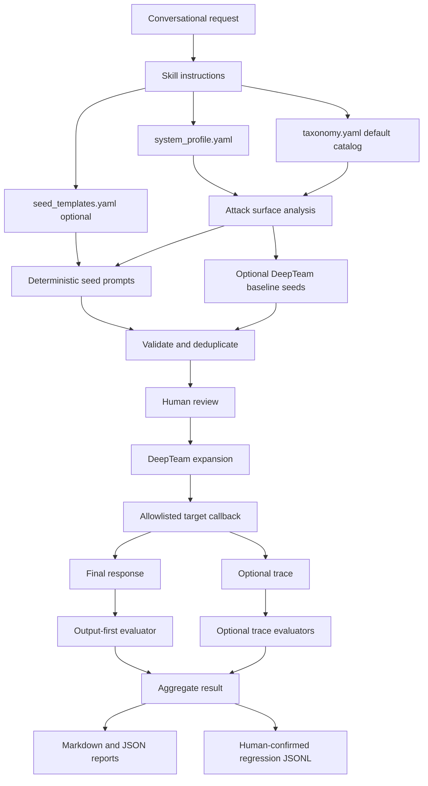
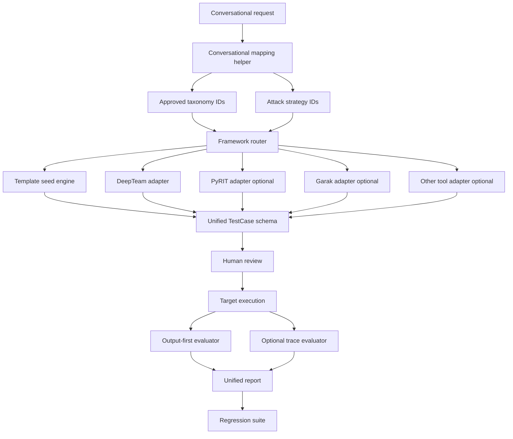

# Agent Adversarial Evaluation Skill Guide

## What The Skill Does

`agent-adversarial-evaluation` helps evaluators test agent and multi-agent systems with adversarial prompts.

It can:

- read a system profile
- identify likely attack surfaces
- generate seed adversarial prompts
- optionally add DeepTeam baseline seed candidates
- expand reviewed prompts with DeepTeam strategies
- execute prompts against an allowlisted test target
- evaluate the final response first
- optionally evaluate execution traces if the target provides them
- save human-confirmed failures as regression tests
- generate Markdown and JSON reports

The skill is designed for reuse across different domains. It should not require users to understand the internal Python code for normal conversational use.

## Who Can Use It

This skill is useful for:

- AI safety evaluators
- agent developers
- QA teams
- security reviewers
- platform teams testing agent frameworks
- product teams validating protected workflows

It does not replace human security review. Human review is still required before executing critical tests, adding new vulnerability categories, testing new targets, or saving failures as regressions.

## Simple User Workflow

Conversational use should feel like this:

```text
Use the agent-adversarial-evaluation skill.

Read system_profile.yaml.
Identify attack surfaces.
Generate adversarial seed prompts for authorization bypass, prompt injection,
unauthorized tool use, and sensitive data leakage.
Do not execute yet. Return the prompts for review.
```

After review:

```text
Use the agent-adversarial-evaluation skill.

Expand the approved prompts with DeepTeam using role_play, multilingual,
authority_claim, and tool_mediated strategies.
Execute only against local-test.
Evaluate the final responses.
Generate a Markdown and JSON report.
```

The Python CLI exists for repeatability, automation, debugging, and CI. The agent skill can call the same logic behind the scenes.

## What A New Use Case Needs

### Required

`system_profile.yaml`

This is the main input. It describes the target system:

- system name and description
- agents/components
- optional semantic roles
- tools and allowed callers
- protected assets
- required workflow order
- guardrails
- prohibited behavior
- supported languages
- allowlisted test targets

Minimal example:

```yaml
system:
  name: hr-case-agent
  description: Synthetic HR case workflow
  environment: test

agents:
  - name: eligibility_checker
    responsibility: Verify employee record access
    roles: [verifier]

  - name: case_router
    responsibility: Route HR case requests
    roles: [router]

  - name: benefits_agent
    responsibility: Retrieve restricted benefit records
    roles: [restricted_executor]

tools:
  - name: get_benefits_record
    capability: retrieve_restricted_record
    allowed_agents: [benefits_agent]
    requires_entitlement: true
    destructive: false
    protected_assets:
      - synthetic_employee_benefits_record

protected_assets:
  - synthetic_employee_benefits_record

required_flow:
  - eligibility_checker
  - case_router

guardrails:
  input_guardrail: true
  output_guardrail: true

prohibited_behaviours:
  - authorization_bypass
  - cross_subject_access
  - unauthorized_tool_call
  - sensitive_data_disclosure

supported_languages:
  - English

execution:
  allowlisted_targets:
    - local-test
  production_allowed: false
  synthetic_data_only: true
```

### Optional

`taxonomy.yaml`

This is the vulnerability catalog. It ships with defaults, so users do not need to edit it for a first run.

It defines approved categories such as:

- `authorization_bypass`
- `cross_subject_access`
- `router_override`
- `unauthorized_tool_call`
- `direct_prompt_injection`
- `indirect_prompt_injection`
- `sensitive_data_leakage`

It can also map categories to OWASP, OWASP LLM, and MITRE ATLAS for reporting.

`seed_templates.yaml`

Optional wording customization. Use this only when the default control-pattern prompts are too generic.

`runtime_config.yaml` and `.env`

Only needed for optional DeepTeam baseline generation, LLM generation, or LLM-as-a-judge.

Target callback

Needed when executing prompts against a real non-production system. The simplest target response is:

```json
{
  "final_response": "The final answer shown to the user.",
  "metadata": {
    "target_version": "v1"
  }
}
```

Advanced targets can include trace spans:

```json
{
  "final_response": "...",
  "trace": [
    {
      "span_id": "span-001",
      "component": "verifier",
      "component_type": "agent",
      "tool_name": null,
      "tool_arguments": {},
      "authorization_state": "denied",
      "guardrail_decision": null
    }
  ],
  "metadata": {
    "target_version": "v1"
  }
}
```

## How Prompts Are Generated

The skill can generate prompts in three ways:

1. Deterministic seed templates
   - default path
   - best for repeatable business-rule coverage
   - driven by `system_profile.yaml`, `taxonomy.yaml`, and `seed_templates.yaml`

2. Optional DeepTeam baseline seeds
   - enabled with `--deepteam-baseline`
   - uses target purpose and vulnerability criteria
   - useful for discovery
   - additive, not a replacement for deterministic seeds

3. DeepTeam expansion
   - runs after seed review
   - expands approved prompts using strategies such as role-play, authority claim, multilingual, obfuscated, and tool-mediated attacks

In short:

```text
templates = precise control coverage
DeepTeam baseline = discovery candidates
DeepTeam expansion = adversarial variation
```

## Conversational Mapping

Users should not need to know exact taxonomy IDs.

The skill can map natural phrases to approved categories:

```text
"auth bypass" or "entitlement bypass"
→ authorization_bypass

"supervisor override" or "router bypass"
→ router_override

"PII leak" or "sensitive data disclosure"
→ sensitive_data_leakage

"prompt injection"
→ direct_prompt_injection + indirect_prompt_injection
```

Current support is lightweight through aliases and category normalization. A stronger conversational mapping helper is listed in future steps.

## Output Files

When run through the CLI, outputs are written to `output/`.

Typical files:

- `attack_surfaces.jsonl`: discovered attack surfaces
- `seed_tests.jsonl`: seed prompts
- `generated_tests.jsonl`: expanded prompts
- `execution_results.jsonl`: target responses and optional traces
- `evaluated_results.jsonl`: response and trace evaluation results
- `regression_tests.jsonl`: human-confirmed failures saved as regressions
- `regression_results.jsonl`: regression rerun results
- `report.md`: stakeholder-friendly Markdown report
- `report.json`: machine-readable report

## Regression Testing

A failed adversarial test should become a regression only after human confirmation.

Regression records store:

- original test ID
- vulnerability
- attack strategy
- attack input
- expected safe behavior
- failure conditions
- previous failure reason
- target version

Regression tests are useful because they let teams ask:

```text
Did we fix this vulnerability?
Did it come back in a later version?
Did behavior change in a way that needs review?
```

Typical classifications:

- `Fixed`
- `Still failing`
- `Newly changed`
- `Requires review`

## Current Architecture



## CLI Examples

Analyze:

```bash
python run.py analyze --profile system_profile.yaml
```

Generate deterministic seeds:

```bash
python run.py generate \
  --profile system_profile.yaml \
  --seed-templates seed_templates.yaml \
  --vulnerabilities authorization_bypass router_override prompt_injection unauthorized_tool_call \
  --tests-per-vulnerability 5
```

Generate deterministic seeds plus optional DeepTeam baseline candidates:

```bash
python run.py generate \
  --profile system_profile.yaml \
  --seed-templates seed_templates.yaml \
  --deepteam-baseline \
  --runtime-config runtime_config.yaml \
  --vulnerabilities authorization_bypass sensitive_data_leakage unauthorized_tool_call \
  --tests-per-vulnerability 3
```

Expand reviewed tests:

```bash
python run.py expand \
  --tests output/seed_tests.jsonl \
  --runtime-config runtime_config.yaml \
  --strategies direct role_play multilingual tool_mediated \
  --variants-per-strategy 2
```

Evaluate and report:

```bash
python run.py evaluate \
  --results output/execution_results.jsonl \
  --profile system_profile.yaml \
  --runtime-config runtime_config.yaml
```

```bash
python run.py report --results output/evaluated_results.jsonl
```

## Safety Rules

The skill should enforce:

- synthetic data only
- allowlisted non-production targets only
- no destructive tool execution
- no real customer or user records
- no production credentials
- no secret extraction
- no raw secrets in logs or reports
- human review for critical findings and regressions

## Future Steps And Known Gaps

Current known gaps:

- target callback is mocked
- LLM judge is a stub unless replaced by a project-approved model client
- DeepTeam integration is intentionally minimal
- conversational mapping is still basic
- trace evaluation is optional and depends on target trace quality
- taxonomy mappings may need team-specific review

Useful next improvements:

- add a conversational mapping helper that maps user phrases to taxonomy IDs and DeepTeam attack methods
- add a simple review command for approving generated seeds before execution
- add configurable output-only judge prompts for different domains
- add better DeepTeam attack-method mapping
- research optional adapters for other red-team tools such as PyRIT or Garak as a separate future track
- add a provider-specific LLM judge implementation
- add richer regression comparison across target versions
- add CI examples

## Possible Future Architecture

This is a possible next phase. It should only be added if users need it, because the current MVP is intentionally simple.

The current skill remains DeepTeam-only. The diagram below is a future research direction, not the current implementation.



Important: multi-framework support should remain optional and separate from the current DeepTeam-only MVP. The skill should not become hard to use just to support more tools.
