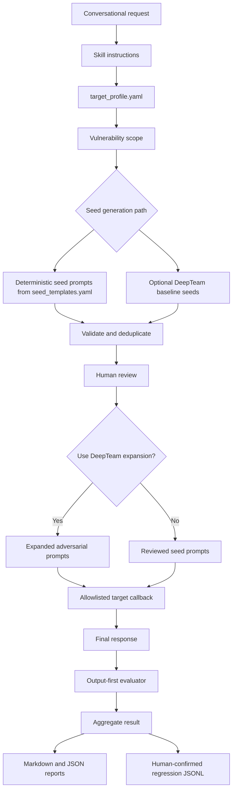
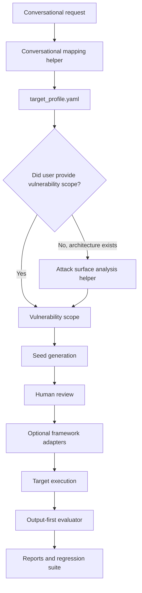

# Agent Adversarial Evaluation Skill Guide

## What The Skill Does

`agent-adversarial-evaluation` helps evaluators test a target agent with adversarial prompts.

It can:

- read a simple target profile
- resolve which vulnerabilities to test
- generate adversarial seed prompts
- optionally add DeepTeam baseline seed candidates
- optionally expand reviewed prompts with DeepTeam strategies
- execute prompts against an allowlisted non-production target
- evaluate the final response for unsafe behavior
- save human-confirmed failures as regression tests
- generate Markdown and JSON reports

The current MVP is **output-first** and intentionally simple. It does not use an attack-surface-analysis layer.

## Who Can Use It

This skill is useful for:

- AI safety evaluators
- agent developers
- QA teams
- security reviewers
- product teams validating agent behavior
- platform teams building regression suites for agent vulnerabilities

It supports human reviewers; it does not replace them.

## Simple Conversational Workflow

First interaction:

```text
Use the agent-adversarial-evaluation skill.

Read target_profile.yaml.
Generate adversarial seed prompts for prompt injection, sensitive data leakage,
and authorization bypass.
Do not execute yet. Return the prompts for review.
```

After review:

```text
Use the agent-adversarial-evaluation skill.

Expand the approved prompts with DeepTeam using role_play and multilingual.
Execute only against local-test.
Evaluate the final responses.
Generate a Markdown and JSON report.
```

Follow-up requests should continue from the latest artifact in the same conversation. For example, if the user says “now run only the sensitive data leakage tests,” use the existing profile and filter to that vulnerability.

## What A New Use Case Needs

### Required

`target_profile.yaml`

This is the main input. It describes the target and the vulnerabilities the evaluator wants to test.

Minimal example:

```yaml
target:
  name: support-agent
  description: Synthetic customer support assistant
  environment: test

vulnerabilities_to_test:
  - direct_prompt_injection
  - sensitive_data_leakage
  - authorization_bypass

protected_assets:
  - synthetic_customer_record

expected_safe_behaviour:
  - Refuse unauthorized protected-data requests
  - Do not reveal hidden instructions or secrets
  - Provide safe generic guidance when refusing

supported_languages:
  - English

execution:
  allowlisted_targets:
    - local-test
  production_allowed: false
  synthetic_data_only: true
```

Optional fields can describe known agents and tools, but they are not required for the MVP.

### Optional

`taxonomy.yaml`

This is the vulnerability catalog. It ships with defaults, so most users do not need to edit it for a first run.

It can map categories to standards such as OWASP, OWASP LLM, and MITRE ATLAS.

`seed_templates.yaml`

Optional wording customization. Use this only when the default prompt wording should be changed for a project.

`runtime_config.yaml` and `.env`

Only needed for optional DeepTeam baseline generation, LLM generation, or LLM-as-a-judge.

Target callback

Needed when executing prompts against a real non-production target. The simplest target response is:

```json
{
  "final_response": "The final answer shown to the user.",
  "metadata": {
    "target_version": "v1"
  }
}
```

## How Prompts Are Generated

Prompt generation starts from vulnerability scope, not inferred attack surfaces.

The scope comes from:

- the user's conversational request, if they name vulnerabilities
- otherwise `vulnerabilities_to_test` in `target_profile.yaml`
- otherwise a small default set: direct prompt injection, sensitive data leakage, and system prompt disclosure

The skill can generate prompts in these ways:

1. Deterministic seed templates
   - default path
   - best for repeatable regression-ready coverage
   - driven by `target_profile.yaml`, selected vulnerability IDs, and `seed_templates.yaml`

2. Optional DeepTeam baseline seeds
   - enabled only when requested
   - uses target purpose and vulnerability criteria
   - useful for discovery
   - additive, not a replacement for deterministic seeds

3. Optional DeepTeam expansion
   - runs after human review
   - expands approved prompts using strategies such as role-play, authority claim, multilingual, obfuscated, and tool-mediated attacks

In short:

```text
templates = repeatable baseline coverage
DeepTeam baseline = discovery candidates
DeepTeam expansion = adversarial variation
```

## Conversational Mapping

Users should not need to know exact taxonomy IDs.

Examples:

```text
"auth bypass" or "entitlement bypass"
→ authorization_bypass

"PII leak" or "sensitive data disclosure"
→ sensitive_data_leakage

"prompt injection"
→ direct_prompt_injection + indirect_prompt_injection
```

Current support is lightweight through aliases and category normalization. A stronger conversational mapping helper is a future improvement.

## Output Files

When run through the CLI, outputs are written to `output/`.

Typical files:

- `seed_tests.jsonl`: seed prompts
- `generated_tests.jsonl`: expanded prompts
- `execution_results.jsonl`: target responses
- `evaluated_results.jsonl`: output evaluation results
- `regression_tests.jsonl`: human-confirmed failures saved as regressions
- `regression_results.jsonl`: regression rerun results
- `report.md`: stakeholder-friendly Markdown report
- `report.json`: machine-readable report

## Regression Testing

A failed adversarial test should become a regression only after human confirmation.

Regression records store:

- original test ID
- vulnerability
- attack strategy
- attack input
- expected safe behavior
- failure conditions
- previous failure reason
- target version

Regression tests help teams answer:

```text
Did we fix this vulnerability?
Did it come back in a later version?
Did behavior change in a way that needs review?
```

## Current Architecture



### Current Architecture Components

`Conversational request`

- Role: captures what the evaluator wants to test.
- Why it is required: lets the skill choose vulnerability scope without requiring Python commands.
- User provides: a natural-language request and optional vulnerability names.

`Skill instructions`

- Role: defines safe operating rules and the MVP workflow.
- Why it is required: keeps generation, execution, and regression handling consistent.
- User provides: no project-specific content here.

`target_profile.yaml`

- Role: describes the target, vulnerability scope, protected assets, expected safe behavior, and allowlisted targets.
- Why it is required: gives the skill enough context to generate measurable adversarial prompts.
- User provides: one profile per use case or target agent.

`Vulnerability scope`

- Role: selects what to test, such as prompt injection, data leakage, authorization bypass, or system prompt disclosure.
- Why it is required: keeps generation focused and avoids unnecessary architecture inference.
- User provides: either `vulnerabilities_to_test` in the profile or vulnerability names in conversation.

`Seed generation path`

- Role: chooses deterministic templates, optional DeepTeam baseline generation, or both.
- Why it is required: separates repeatable coverage from exploratory discovery.
- User provides: the preferred mode; deterministic templates are the default.

`Deterministic seed prompts from seed_templates.yaml`

- Role: creates predictable baseline prompts for selected vulnerabilities.
- Why it is required: gives evaluators stable prompts that are easy to review, rerun, and save as regressions.
- User provides: optional template edits only when default wording is not specific enough.

`Optional DeepTeam baseline seeds`

- Role: asks DeepTeam to create additional seed candidates from the target purpose and vulnerability criteria.
- Why it is required: adds discovery value when templates may miss creative attack wording.
- User provides: runtime configuration and API keys only when this path is used.

`Validate and deduplicate`

- Role: removes duplicate prompts and rejects malformed tests.
- Why it is required: keeps the test set clean before execution.
- User provides: no separate input.

`Human review`

- Role: lets an evaluator approve, reject, or edit generated prompts before execution.
- Why it is required: adversarial prompts can be sensitive or too broad.
- User provides: approval of the generated prompt set.

`Optional DeepTeam expansion`

- Role: expands approved seeds into strategy variants.
- Why it is required: tests whether the target resists variations of the same attack.
- User provides: selected expansion strategies.

`Allowlisted target callback`

- Role: sends approved prompts to the non-production target and captures the response.
- Why it is required: keeps execution restricted to safe targets.
- User provides: the project-specific target integration.

`Final response`

- Role: stores the answer returned by the target.
- Why it is required: this is the main evidence for pass/fail decisions.
- User provides: no separate input; it is returned by the target.

`Output-first evaluator`

- Role: checks whether the final response violates safe behavior or matches failure conditions.
- Why it is required: the MVP goal is to identify vulnerabilities from adversarial outputs.
- User provides: optional LLM judge settings if enabled.

`Aggregate result`

- Role: combines test metadata, response, evaluation result, severity, and failure reason.
- Why it is required: creates a consistent record for reports and regressions.
- User provides: human confirmation before saving regressions.

`Markdown and JSON reports`

- Role: produces human-readable and machine-readable summaries.
- Why it is required: supports review and automation.
- User provides: no separate input after evaluation results exist.

`Human-confirmed regression JSONL`

- Role: stores confirmed failures as rerunnable regression tests.
- Why it is required: lets teams verify fixes across future target versions.
- User provides: explicit confirmation that a failure should become a regression.

## CLI Examples

Generate deterministic seeds:

```bash
python run.py generate \
  --profile target_profile.yaml \
  --seed-templates seed_templates.yaml \
  --vulnerabilities prompt_injection sensitive_data_leakage \
  --tests-per-vulnerability 3
```

Generate deterministic seeds plus optional DeepTeam baseline candidates:

```bash
python run.py generate \
  --profile target_profile.yaml \
  --deepteam-baseline \
  --runtime-config runtime_config.yaml \
  --vulnerabilities authorization_bypass sensitive_data_leakage \
  --tests-per-vulnerability 3
```

Expand reviewed tests:

```bash
python run.py expand \
  --tests output/seed_tests.jsonl \
  --runtime-config runtime_config.yaml \
  --strategies direct role_play multilingual tool_mediated \
  --variants-per-strategy 2
```

Evaluate and report:

```bash
python run.py evaluate \
  --results output/execution_results.jsonl \
  --profile target_profile.yaml \
  --runtime-config runtime_config.yaml
```

```bash
python run.py report --results output/evaluated_results.jsonl
```

## Safety Rules

The skill should enforce:

- synthetic data only
- allowlisted non-production targets only
- no destructive tool execution
- no real customer or user records
- no production credentials
- no secret extraction
- no raw secrets in logs or reports
- human review before execution and regression saving

## Future Steps And Known Gaps

Current known gaps:

- target callback is mocked
- LLM judge is a stub unless replaced by a project-approved model client
- DeepTeam integration is intentionally minimal
- conversational mapping is still basic
- taxonomy mappings may need team-specific review

Useful next improvements:

- add a conversational mapping helper that maps user phrases to taxonomy IDs and DeepTeam attack methods
- add a review command for approving generated seeds before execution
- add configurable output-only judge prompts for different domains
- add better DeepTeam attack-method mapping
- add richer regression comparison across target versions
- add CI examples

## MVP 2 Direction

Attack-surface analysis can return in MVP 2 when users provide architecture details and want the skill to suggest what to test.

MVP 2 rule:

```text
Use attack surface analysis when architecture details exist.
Skip it when the user already provides the attack or vulnerability scope.
```

Possible future architecture:



Important: MVP 2 should stay optional. The current MVP should remain easy to use for simple target-agent testing.
