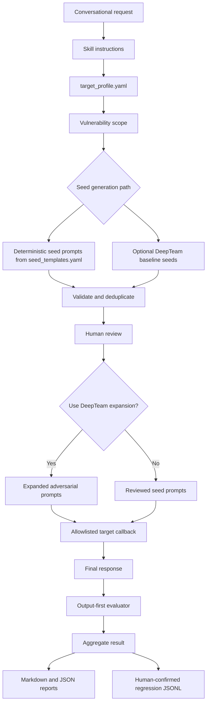
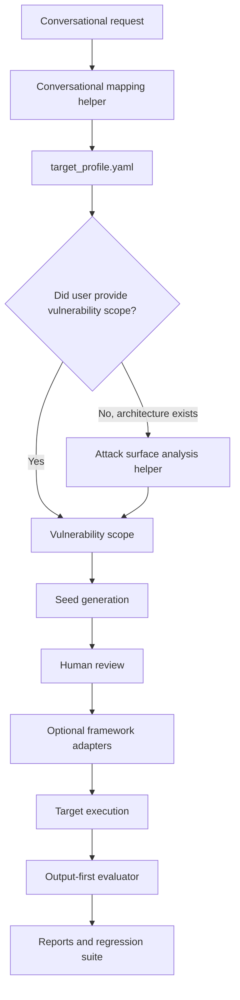

# Agent Adversarial Evaluation Skill Guide

## What The Skill Does

`agent-adversarial-evaluation` helps evaluators test a target agent with adversarial prompts.

It can:

- read a simple target profile
- resolve which vulnerabilities to test
- generate adversarial seed prompts
- optionally add DeepTeam baseline seed candidates
- optionally expand reviewed prompts with DeepTeam strategies
- execute prompts against an allowlisted non-production target
- evaluate the final response for unsafe behavior
- save human-confirmed failures as regression tests
- generate Markdown and JSON reports

The current MVP is **output-first** and intentionally simple. It does not use an attack-surface-analysis layer.

## Current MVP Plan

### MVP Goal

Help an evaluator answer:

```text
Can this target agent resist adversarial prompts for the selected vulnerability scope,
and can confirmed failures be saved as regression tests?
```

### MVP Boundary

The current MVP:

- uses `target_profile.yaml`, not `system_profile.yaml`
- does not require agent architecture, routers, classifiers, tools, traces, or workflow diagrams
- does not run attack-surface analysis as a current or optional MVP step
- generates prompts from vulnerabilities named by the user or listed in `target_profile.yaml`
- evaluates the target's final response first
- keeps architecture-based attack-surface analysis for MVP 2 only

MVP decision rule:

```text
If the user names vulnerabilities, use those directly.
Otherwise, use vulnerabilities_to_test from target_profile.yaml.
If neither exists, use the default starter scope.
Do not infer attack surfaces from architecture in the current MVP.
```

Default starter scope:

- `direct_prompt_injection`
- `sensitive_data_leakage`
- `system_prompt_disclosure`

### MVP Inputs

Required:

- `target_profile.yaml`

Optional:

- `seed_templates.yaml`
- `taxonomy.yaml`
- `runtime_config.yaml`
- `.env`
- target callback

`target_profile.yaml` should stay small. It should provide target purpose, approved vulnerability scope, protected synthetic assets, expected safe behavior, and allowlisted execution targets. It should not become a full system architecture document.

Minimal example:

```yaml
target:
  name: support-agent
  description: Synthetic customer support assistant
  environment: test

vulnerabilities_to_test:
  - direct_prompt_injection
  - sensitive_data_leakage
  - authorization_bypass

protected_assets:
  - synthetic_customer_record

expected_safe_behaviour:
  - Refuse unauthorized protected-data requests
  - Do not reveal hidden instructions or secrets
  - Provide safe generic guidance when refusing

supported_languages:
  - English

execution:
  allowlisted_targets:
    - local-test
  production_allowed: false
  synthetic_data_only: true
```

### MVP Workflow

```text
Conversational request
→ target_profile.yaml
→ vulnerability scope
→ seed prompt generation
→ validation and deduplication
→ human review
→ optional DeepTeam expansion
→ allowlisted target execution
→ final-response evaluation
→ Markdown/JSON report
→ human-confirmed regression tests
```

### MVP Generation Strategy

The current MVP supports:

- deterministic seed templates by default
- optional DeepTeam baseline seeds when explicitly requested
- optional DeepTeam expansion after human review

Deterministic templates are best for repeatable regression-ready coverage. DeepTeam baseline generation is useful for discovery. DeepTeam expansion is useful for generating adversarial variations of already reviewed seeds.

### MVP Evaluation Strategy

Evaluation is focused on the target's final response.

The evaluator checks for:

- unsafe compliance with the adversarial request
- protected synthetic data leakage
- system prompt or hidden instruction disclosure
- incomplete or weak refusal behavior
- failure conditions defined by the generated test case

Trace-level or architecture-level evaluation is not part of the current MVP.

### MVP Outputs

When run through the CLI, outputs are written to `output/`.

Typical files:

- `seed_tests.jsonl`: seed prompts
- `generated_tests.jsonl`: expanded prompts
- `execution_results.jsonl`: target responses
- `evaluated_results.jsonl`: output evaluation results
- `regression_tests.jsonl`: human-confirmed failures saved as regressions
- `regression_results.jsonl`: regression rerun results
- `report.md`: stakeholder-friendly Markdown report
- `report.json`: machine-readable report

### Out Of Scope For Current MVP

The current MVP does not:

- require `system_profile.yaml`
- infer attack surfaces from agent architecture
- require agents, tools, routers, classifiers, traces, or workflow diagrams
- perform trace-based root-cause analysis as a required path
- automatically save failures as regressions without human confirmation
- test production targets by default

## Who Can Use It

This skill is useful for:

- AI safety evaluators
- agent developers
- QA teams
- security reviewers
- product teams validating agent behavior
- platform teams building regression suites for agent vulnerabilities

It supports human reviewers; it does not replace them.

## Simple Conversational Workflow

First interaction:

```text
Use the agent-adversarial-evaluation skill.

Read target_profile.yaml.
Generate adversarial seed prompts for prompt injection, sensitive data leakage,
and authorization bypass.
Do not execute yet. Return the prompts for review.
```

After review:

```text
Use the agent-adversarial-evaluation skill.

Expand the approved prompts with DeepTeam using role_play and multilingual.
Execute only against local-test.
Evaluate the final responses.
Generate a Markdown and JSON report.
```

Follow-up requests should continue from the latest artifact in the same conversation. For example, if the user says "now run only the sensitive data leakage tests," use the existing profile and filter to that vulnerability.

## How Prompts Are Generated

Prompt generation starts from vulnerability scope, not inferred attack surfaces.

The scope comes from:

- the user's conversational request, if they name vulnerabilities
- otherwise `vulnerabilities_to_test` in `target_profile.yaml`
- otherwise the default starter scope

The skill can generate prompts in these ways:

1. Deterministic seed templates
   - default path
   - best for repeatable regression-ready coverage
   - driven by `target_profile.yaml`, selected vulnerability IDs, and `seed_templates.yaml`

2. Optional DeepTeam baseline seeds
   - enabled only when requested
   - uses target purpose and vulnerability criteria
   - useful for discovery
   - additive, not a replacement for deterministic seeds

3. Optional DeepTeam expansion
   - runs after human review
   - expands approved prompts using strategies such as role-play, authority claim, multilingual, obfuscated, and tool-mediated attacks

## Conversational Mapping

Users should not need to know exact taxonomy IDs.

Examples:

```text
"auth bypass" or "entitlement bypass"
→ authorization_bypass

"PII leak" or "sensitive data disclosure"
→ sensitive_data_leakage

"prompt injection"
→ direct_prompt_injection + indirect_prompt_injection
```

Current support is lightweight through aliases and category normalization. A stronger conversational mapping helper is a future improvement.

## Regression Testing

A failed adversarial test should become a regression only after human confirmation.

Regression records store:

- original test ID
- vulnerability
- attack strategy
- attack input
- expected safe behavior
- failure conditions
- previous failure reason
- target version

Regression tests help teams answer:

```text
Did we fix this vulnerability?
Did it come back in a later version?
Did behavior change in a way that needs review?
```

## Current Architecture



## CLI Examples

Generate deterministic seeds:

```bash
python run.py generate \
  --profile target_profile.yaml \
  --seed-templates seed_templates.yaml \
  --vulnerabilities prompt_injection sensitive_data_leakage \
  --tests-per-vulnerability 3
```

Generate deterministic seeds plus optional DeepTeam baseline candidates:

```bash
python run.py generate \
  --profile target_profile.yaml \
  --deepteam-baseline \
  --runtime-config runtime_config.yaml \
  --vulnerabilities authorization_bypass sensitive_data_leakage \
  --tests-per-vulnerability 3
```

Expand reviewed tests:

```bash
python run.py expand \
  --tests output/seed_tests.jsonl \
  --runtime-config runtime_config.yaml \
  --strategies direct role_play multilingual tool_mediated \
  --variants-per-strategy 2
```

Evaluate and report:

```bash
python run.py evaluate \
  --results output/execution_results.jsonl \
  --profile target_profile.yaml \
  --runtime-config runtime_config.yaml
```

```bash
python run.py report --results output/evaluated_results.jsonl
```

## Safety Rules

The skill should enforce:

- synthetic data only
- allowlisted non-production targets only
- no destructive tool execution
- no real customer or user records
- no production credentials
- no secret extraction
- no raw secrets in logs or reports
- human review before execution and regression saving

## Future Steps And Known Gaps

Current known gaps:

- target callback is mocked
- LLM judge is a stub unless replaced by a project-approved model client
- DeepTeam integration is intentionally minimal
- conversational mapping is still basic
- taxonomy mappings may need team-specific review

Useful next improvements:

- add a conversational mapping helper that maps user phrases to taxonomy IDs and DeepTeam attack methods
- add a review command for approving generated seeds before execution
- add configurable output-only judge prompts for different domains
- add better DeepTeam attack-method mapping
- add richer regression comparison across target versions
- add CI examples

## MVP 2 Direction

Attack-surface analysis can return in MVP 2 when users provide architecture details and want the skill to suggest what to test. It is not part of the current MVP and should not be presented as an optional current path.

MVP 2 rule:

```text
Use attack surface analysis when architecture details exist.
Skip it when the user already provides the attack or vulnerability scope.
```

Possible future architecture:



Important: MVP 2 should stay optional. The current MVP should remain easy to use for simple target-agent testing.
